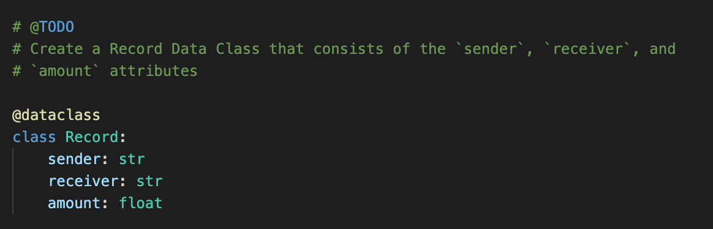
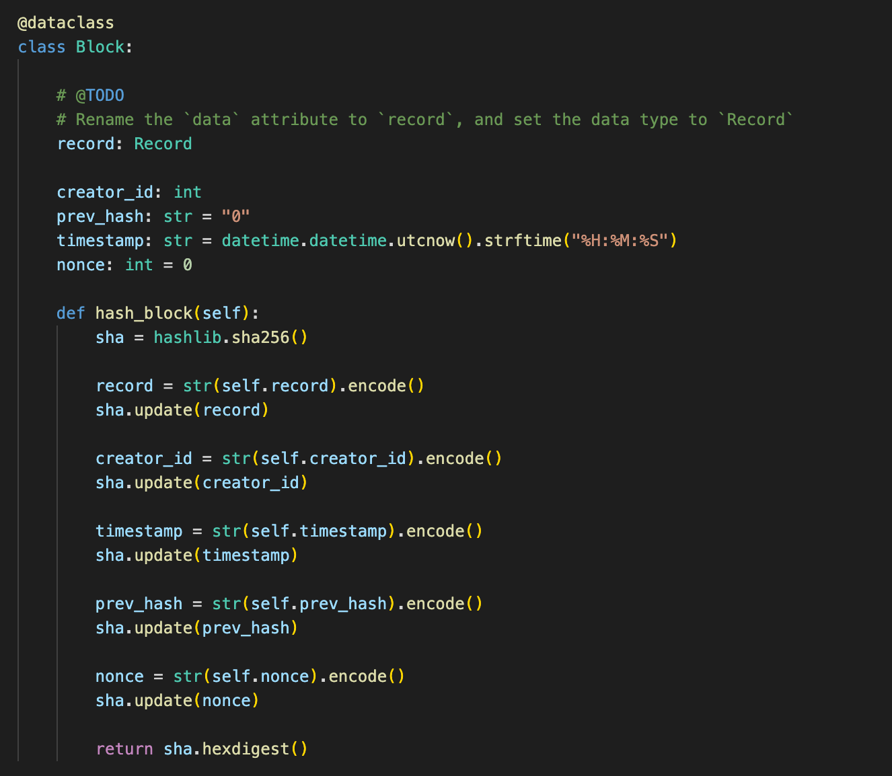
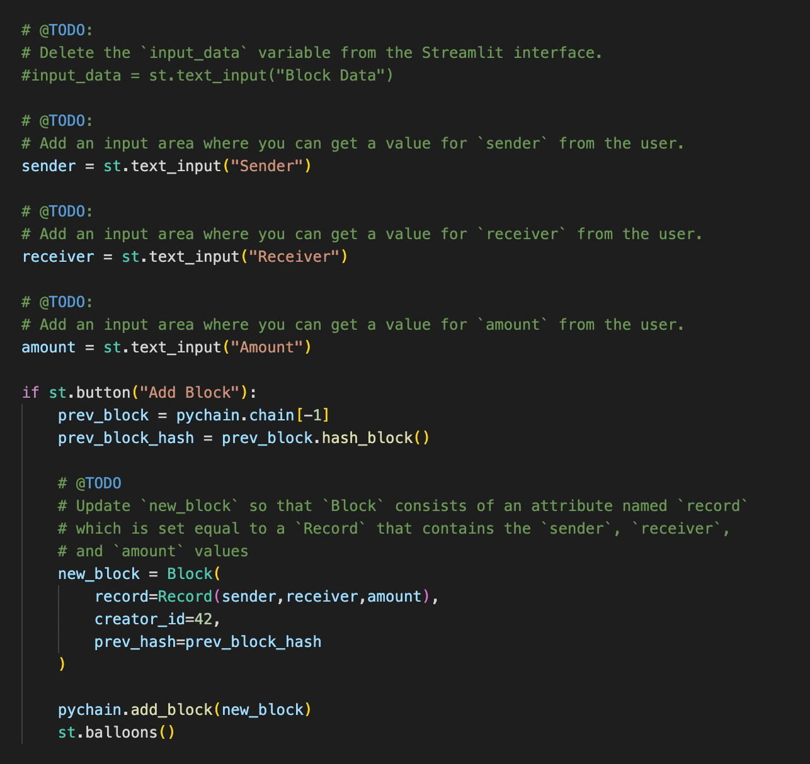
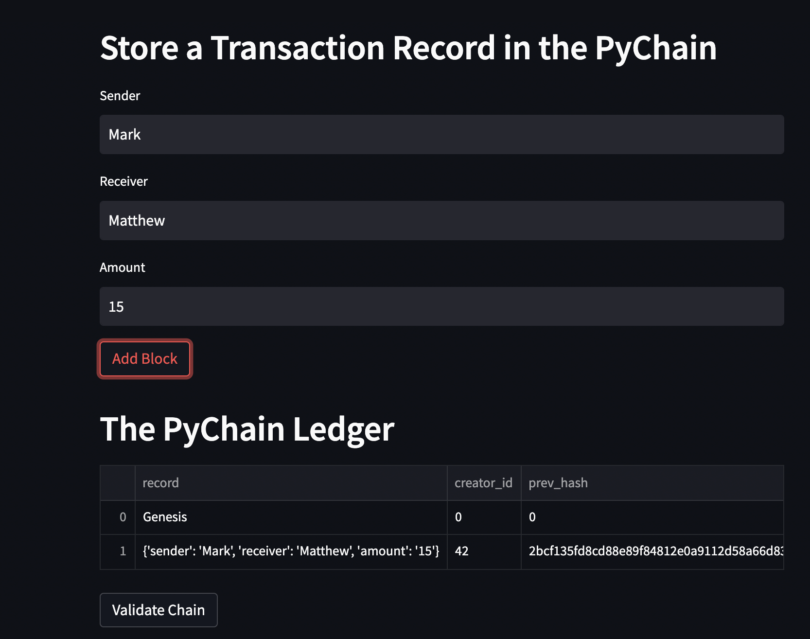
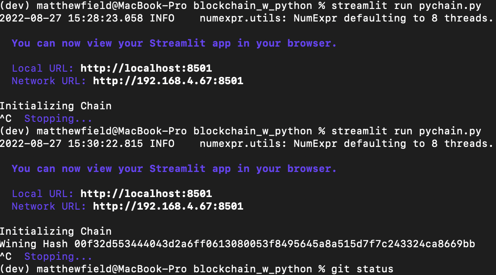

# Blockchain_w_python
## Blockchain based ledger 
---
## Technologies 

* [pandas](https://github.com/pandas-dev/pandas) - For data analysis and manipulation.
* [streamlit](https://github.com/streamlit/streamlit) - For frontend UI
* [hashlib](https://docs.python.org/3/library/hashlib.html)
* [dataclasses](https://docs.python.org/3/library/dataclasses.html)
 -- 
## Imports 

        '''

        import streamlit as st
        from dataclasses import dataclass
        from typing import Any, List
        import datetime as datetime
        import pandas as pd
        import hashlib 

        '''

---
### Create a record data class 

### Modify the Existing Block Data Class to Store Record Data

### Add User Inputs to the Streamlit Interface

### Testing Streamlit 

### CLI perspective

---
## Contributors

The starter code was contributed by the [FinTech Bootcamp at Columbia Engineering](https://bootcamp.cvn.columbia.edu/fintech/)

Matthew Field finalized the application, his work is availble to view on [Github](https://github.com/mbf2139)

---
## License

MIT

